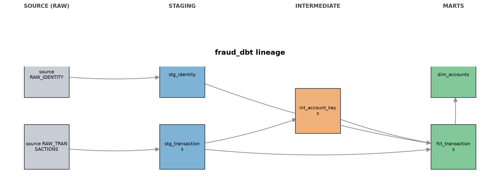
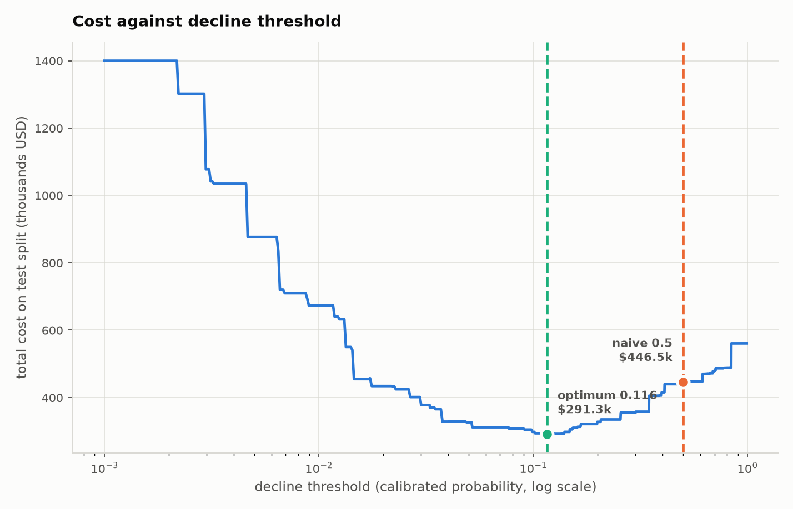

# Fraud Risk Decisioning System

**At the cost-optimal decline threshold this system prevents $341,479 of the
$495,244 in fraud on a held-out 30-day test period, catching 69.0% of fraud
dollars while declining 6.5% of legitimate transactions. Total modelled cost
is $291,334, which is $155,129 cheaper than a naive 0.5 cutoff and $285,961
cheaper than approving everything.**

Those figures rest on stated cost assumptions, not measured ones. See
[Cost assumptions](#cost-assumptions).

## What it does and what it found

The system scores card-not-present transactions for fraud, converts the score
into a calibrated probability, and converts that probability into an
approve-or-decline decision by pricing every possible threshold in dollars.

The interesting part is the third step. A fraud model is usually judged on
PR-AUC, but nobody is paid in PR-AUC. Once each outcome has a price, the
question becomes where to set the threshold, and the answer is not 0.5. It is
0.1160. The naive cutoff looks far better on precision (0.75 against 0.26) and
is 53% more expensive, because it optimizes the wrong thing: it avoids false
declines that cost about $12 each while waving through frauds that cost about
$176 each.

Five findings worth stating plainly:

1. **The optimum is far from 0.5, and the shape around it is not stable.** At
   this operating point a threshold 20% lower costs +4.6%, 20% higher costs
   +0.4%. At earlier operating points the asymmetry ran the other way. Do not
   over-read the local shape of a curve estimated from 3,282 frauds.
2. **The V block genuinely matters.** A clean ablation on identical splits
   shows the 339 V columns are worth +0.0275 test PR-AUC and $17,314 of cost,
   CI [-$27,894, -$6,624], which does not span zero.
3. **Time-normalising the D columns is the single most consistent improvement
   found.** Replacing "days since an event" with "the day the event happened"
   gained **+0.0228 test PR-AUC in 4 of 4 walk-forward folds** and $38,140 of
   cost. See [improvements_summary.md](reports/improvements_summary.md).
4. **Chasing the train/test gap made the model worse.** Regularisation closed
   the gap more than any other change tested and was the worst variant on cost,
   losing all four folds. The best variant has the widest gap. An earlier
   version of this README treated the gap as a defect to fix; that was wrong.
5. **Measurement noise is roughly $10,000.** Any single change worth less than
   that cannot be told from luck on one test window, which is why every
   comparison now runs on four folds with intervals.

## Results

Evaluated on `txn_day >= 150`: 94,636 transactions, 3,282 fraudulent.

| Policy | Total cost | Fraud dollars caught | Legit declined | Saving vs optimum |
| --- | --- | --- | --- | --- |
| **Chosen threshold 0.1160** | **$291,334** | $341,479 (69.0%) | 5,960 (6.52%) | - |
| Naive 0.5 cutoff | $446,463 | $113,617 (22.9%) | 323 (0.35%) | $155,129 |
| Approve everything | $577,294 | $0 (0%) | 0 (0%) | $285,961 |
| Decline everything | $1,414,895 | $495,244 (100%) | 91,354 (100%) | $1,123,561 |

| Decision quality | At 0.1160 | At 0.50 |
| --- | --- | --- |
| Fraud caught (TP) | 2,137 | 992 |
| Legit declined (FP) | 5,960 | 323 |
| Fraud missed (FN) | 1,145 | 2,290 |
| True negatives | 85,394 | 91,031 |
| Precision | 0.2639 | 0.7544 |
| Recall | 0.6511 | 0.3023 |
| False decline rate | 6.524% | 0.354% |

### Feature-set comparison, identical splits

Every row uses the same four time windows, seed, and hyperparameters. Only the
feature set changes. Cost differences are against the full 437 model, with a
600-resample paired bootstrap.

| Feature set | Test PR-AUC | Gap | Fit time | Cost | vs 437 | 95% CI | Significant |
| --- | --- | --- | --- | --- | --- | --- | --- |
| Full 437 | 0.5086 | 0.3712 | 35.9s | $298,574 | - | - | - |
| **Top 200 (shipped)** | 0.5015 | 0.3949 | **29.0s** | **$296,570** | **-$2,003** | [-$9,817, +$5,528] | no |
| Top 100 | 0.4902 | 0.3890 | 16.4s | $309,584 | +$11,011 | [+$1,715, +$20,682] | **yes** |
| Top 50 | 0.4888 | 0.3548 | 11.7s | $321,245 | +$22,672 | [+$10,675, +$33,319] | **yes** |

Top 200 is cheaper on the point estimate but the difference is inside the noise
band, so the honest claim is that it is **no worse** than the full set while
using 54% fewer features and training 19% faster. That is why it ships. Cutting
to 100 or 50 is significantly worse and is not a viable trade.

The top 200 features carry 89.4% of total gain; 148 of the 437 were never used
for a split at all.

### V-block ablation

| | Features | Test PR-AUC | Train PR-AUC | ROC-AUC | Fit time | Cost |
| --- | --- | --- | --- | --- | --- | --- |
| With V block | 437 | 0.5086 | 0.8798 | 0.8863 | 35.9s | $298,574 |
| Without V block | 98 | 0.4811 | 0.8642 | 0.8804 | 13.9s | $315,980 |
| **Contribution of V** | **339** | **+0.0275** | +0.0156 | +0.0060 | +22.0s | **-$17,406** |

Bootstrap on the cost difference: mean **-$17,314**, 95% CI
[-$27,894, -$6,624]. Entirely below zero, so this one is real. The V block is
the single most valuable feature group in the build.

### Improvement pass

Six experiments on a four-fold walk-forward harness. Two shipped, four
rejected. Full record in
[improvements_summary.md](reports/improvements_summary.md).

| Change | Verdict | Evidence |
| --- | --- | --- |
| Time-normalise the D columns | **shipped** | +0.0228 PR-AUC, 4 of 4 folds, -$38,140 |
| Walk-forward harness, out-of-sample threshold | **shipped** | replaces a single window; fixes a protocol flaw |
| Cost assumption sensitivity surface | **shipped** | 15x threshold range across plausible assumptions |
| Better account proxy (6 candidates) | rejected | best is -$10k over 4 folds, t = -1.6, 2 of 4 folds |
| Count-encode high-cardinality categoricals | rejected | +$7,264, cheaper in 1 of 4 folds |
| Stronger regularisation | rejected | +$17,740, cheaper in 0 of 4 folds |

The threshold was previously swept on the test split, which is optimistic. It
is now chosen on cross-fitted out-of-fold calibration probabilities and only
then applied to test.

## Model quality

| Metric | Value |
| --- | --- |
| PR-AUC, test, raw | 0.4933 |
| PR-AUC, test, calibrated | 0.4757 |
| ROC-AUC, test | 0.8926 |
| Brier, test, raw | 0.024119 |
| Brier, test, calibrated | 0.023636 |
| PR-AUC, train | 0.9448 |
| Features | 200, with D columns time-normalised |

Isotonic calibration now **improves** Brier on test (0.024119 to 0.023636,
+2.00%), the first time in this project. Two earlier attempts to fix that by
restructuring the splits failed; a feature transform resolved it.

Sensitivity: a threshold 20% lower (0.0928) costs +4.60%; 20% higher (0.1392)
costs +0.42%. The direction of this asymmetry has flipped between model
versions that cannot be told apart on cost, so it should not be treated as a
finding.

**Caveat on the measurement.** A bootstrap of the cost at the chosen threshold
has a standard deviation of about $9,900 and a 95% interval roughly $38,000
wide. The top 100 frauds carry 25.1% of all fraud dollars in a test set of only
3,282 frauds, so the total moves substantially on where a few large
transactions fall. Treat any single improvement smaller than about $10,000 as
unproven until it is confirmed across multiple test periods.

## Architecture

```
S3 (ca-central-1)  ->  Snowflake external stage  ->  FRAUD.RAW
                                                        |
                                             dbt: STAGING (views)
                                                        |
                                             dbt: MARTS (tables)
                                                        |
                                    LightGBM -> isotonic -> threshold sweep
```



| Layer | Object | Rows | Columns |
| --- | --- | --- | --- |
| RAW | `RAW_TRANSACTIONS` | 590,540 | 395 |
| RAW | `RAW_IDENTITY` | 144,233 | 41 |
| STAGING | `stg_transactions`, `stg_identity`, `int_account_keys` | views | |
| MARTS | `fct_transactions` | 590,540 | 443 |
| MARTS | `dim_accounts` | 217,850 | 11 |

`fct_transactions` carries 443 columns: the behavioural features, the C, D and
M blocks, the full V block (V1-V339), and the identity block (id_01-id_38,
DeviceType, DeviceInfo). 437 are eligible for the model; `transaction_id`,
`account_id`, `txn_day`, `transaction_dt`, `prev_transaction_dt` and the label
are excluded. **The shipped model uses the top 200 of those 437 by gain**,
listed in `models/selected_features.json` and produced by
`src/prune_features.py`. Delete that file to fall back to all 437.

Interactive lineage is in [reports/dbt_docs/index.html](reports/dbt_docs/index.html),
exported so it outlives the Snowflake trial. 17 dbt tests pass, including an
exact row-count assertion and a direct anti-leakage assertion.

**Leakage control.** Every window feature uses
`RANGE BETWEEN <bound> PRECEDING AND 1 PRECEDING`, partitioned by account and
ordered by `transaction_dt`. `RANGE` rather than `ROWS` is deliberate: it
excludes transactions sharing a timestamp with the current row, not just the
current row. Verified three ways in
[verification.md](reports/verification.md): a dbt test asserting every
account's first transaction has zero prior counts, an independent pandas
recomputation on sampled accounts, and printed transaction sequences.

**Time splits.** Four disjoint windows, so early stopping and calibration
never share data:

| Split | Days | Rows | Fraud rate |
| --- | --- | --- | --- |
| train | < 110 | 380,100 | 0.03418 |
| early stopping | 110-129 | 62,266 | 0.04084 |
| calibration | 130-149 | 53,538 | 0.03448 |
| test | >= 150 | 94,636 | 0.03468 |

The early-stopping window runs 16.7% hot against the 0.0350 base rate. That is
inside the 30% tolerance but it is the noisiest of the four.

## Data and its limitations

IEEE-CIS Fraud Detection, 590,540 transactions over 182 days. Four limitations
shape everything above.

**The account identifier is constructed, not given.** IEEE-CIS has no account
or customer id. The proxy concatenates `card1`, `addr1`, and `txn_day - D1`,
where D1 is days since the card first appeared, so the third component is a
stable card start date. This yields 217,850 accounts. 88.7% of rows get the
full key; 11.3% fall back to a degraded tier, tracked in `account_key_tier`.
**If the proxy is wrong, every behavioural feature is wrong**, and there is no
ground truth to check it against.

**Account sizes are heavily skewed.** The median account has 1 transaction,
because 57.5% of cards appear exactly once. Weighted by transaction, which is
what the features actually see, the median account has 5. 21.2% of
transactions will never have prior-window history.

**The competition test set is unlabeled**, so the split is a time split within
the labeled training data only. There is no evaluation against the
competition's own holdout, and these numbers are not comparable to leaderboard
scores.

**Identity data covers only 24.4% of transactions.** All 40 identity columns
are null for the other 75.6%. `has_identity` is a feature in its own right,
since the absence is informative.

Two smaller notes: `TransactionDT` is seconds from an unstated origin, so
`txn_hour` and `txn_dow` are relative and no real calendar date is recoverable.
And `card1` is an anonymized card identifier, not a card number.

## Cost assumptions

**These are assumptions, not facts.** IEEE-CIS contains no chargeback, margin,
or churn data. They are plausible mid-market card-not-present values chosen to
make the tradeoff explicit. Every dollar figure in this README inherits their
uncertainty.

| Assumption | Value |
| --- | --- |
| Chargeback fee | $25.00 |
| Margin rate | 2.5% |
| Churn probability after a false decline | 5% |
| Account lifetime value | $200.00 |
| Manual review cost | $2.00 |

| Outcome | Modelled cost |
| --- | --- |
| Fraud approved | transaction amount + $25 |
| Legitimate declined | 2.5% margin + 5% x $200 churn + $2 review |
| Fraud declined | $2 review |
| Legitimate approved | $0 |

Worked arithmetic for both boundary policies is in
[verification.md](reports/verification.md) under "Reconciling the extremes",
so the cost function can be checked by hand.



## How to reproduce

Requires Python 3.10 or later. Credentials go in `.env` at the repo root, which
is gitignored; see the variable names in `src/load_to_snowflake.py`.

```bash
python -m venv .venv && source .venv/bin/activate && pip install -r requirements.txt
```

```bash
python src/prepare_data.py && python src/load_to_snowflake.py
```

```bash
cd fraud_dbt && set -a && source ../.env && set +a && dbt build && dbt docs generate
```

```bash
python src/verify_part1.py && python src/train_model.py && python src/decision_layer.py
```

Experiments, all offline against the cached parquet and none requiring
Snowflake:

```bash
python src/cost_sensitivity.py && python src/exp_account_proxy.py && python src/exp_model_improvements.py
```

The model stage reads `data/parquet/fct_transactions.parquet` if it exists and
only queries Snowflake otherwise, so **steps 2 and 3 can be skipped entirely
once that file exists**. This is deliberate: the Snowflake account is a 30-day
trial and the modelling work has to outlive it. The cached table is 443 columns
wide, so the pull streams Arrow batches to parquet in float32 rather than
materialising it in memory; peak usage is about 1.6 GB.

## What is not done yet

- **No step-up authentication path.** Every decline is a hard decline. A real
  system routes some to additional verification, which changes the cost model
  substantially.
- **The account proxy is unvalidated.** It should be checked against `card2`,
  `card5`, and device fingerprints before anyone trusts it.
- **Calibration drift is unresolved.** Separating the early-stopping and
  calibration windows shrank the Brier degradation from -0.77% to -0.11% but
  did not eliminate it. The remaining cause is period-to-period drift, which
  argues for refitting the calibrator on a rolling recent window.
- **No drift monitoring**, which is what would catch the above in production.
- **Pruning was selected on the test split**, before the walk-forward harness
  existed. It should be re-run on the four folds.
- **Richer account-derived features are the open opportunity.** Only 8 of 200
  features derive from the account key, which is why swapping the key changed
  little. Building more backward-looking aggregates over it is untested and is
  the most promising remaining lever.
- **The train/test gap is not a useful target.** Attacking it directly made the
  model worse. Left as is, deliberately.
- **The cost model has one global threshold.** A per-transaction
  expected-cost rule is the correct decision rule under these assumptions and
  is implemented nowhere. It measured -$5,186 with a CI spanning zero.
- **No CI, no scheduling, no serving.** No orchestration, no API, no monitoring
  of live scores.
- **Cost assumptions are unvalidated.** They should come from finance, not from
  a README.
