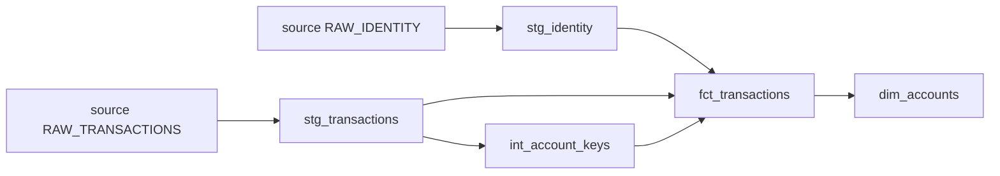

# fraud_dbt lineage

Rendered copy: `dag.png`. Interactive: `dbt_docs/index.html`.

```mermaid
graph LR
  n0["source RAW_TRANSACTIONS"]
  n1["source RAW_IDENTITY"]
  n2["stg_transactions"]
  n3["stg_identity"]
  n4["dim_accounts"]
  n5["fct_transactions"]
  n6["int_account_keys"]
  n0 --> n2
  n1 --> n3
  n2 --> n5
  n2 --> n6
  n3 --> n5
  n5 --> n4
  n6 --> n5
```
